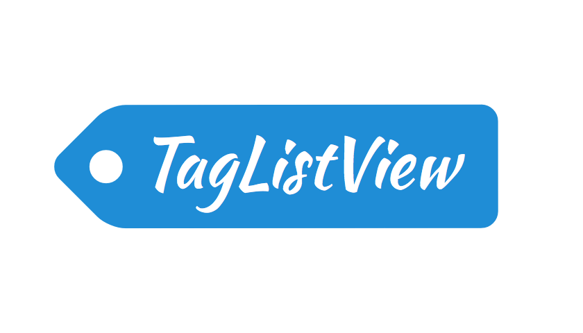

<p align="center">
  
</p>

[](https://travis-ci.org/andreamazz/AMTagListView)
[](http://cocoapods.org/?q=amtaglistview)
[](https://coveralls.io/r/andreamazz/AMTagListView)
[](https://github.com/Carthage/Carthage)
[](https://www.paypal.com/cgi-bin/webscr?cmd=_s-xclick&hosted_button_id=46FNZD4PDVNRU)

UIScrollView subclass that allows to add a list of highly customizable tags. You can customize colors, border radius, and the tail of the tag. Tags can be added in bulk or dynamically one by one. The newly inserted tag will automatically arrange itself inside the scrollview.

<p align="center">
  <a href='https://appetize.io/app/ax3k4v3wn05pa8z1ue6pvjnh38' alt='Live demo'>
    
  </a>
</p>

##Screenshot


##Setup with CocoaPods

##Swift
```
pod 'AMTagListView'
```
When using a bridging header:
```objc
#import <AMTagListView.h>
```
When using dynamic frameworks:
```swift
@import AMTagListView
```

##Usage
You can create a `AMTagListView` in your storyboard, or programmatically:

####Objective-C
```objc
// Init
AMTagListView *tagListView = [[AMTagListView alloc] initWithFrame:frame];
[self.view addSubview:tagListView];
```

####Swift
```swift
let tagListView = AMTagListView(frame: frame)
view.addSubview(tagListView)
```

##Adding tags
####Objective-C
```objc
// Add one tag
[self.tagListView addTag:@"my tag"];

// Add multiple tags
[self.tagListView addTags:@[@"my tag", @"some tag"]];
```

####Swift
```swift
// Add one tag
tagListView.addTag("my tag")

// Add multiple tags
tagListView.addTags(["my tag", "some tag"])
```

##Arranging tags
The tags are rearranged when you use the method calls listed above. You can also avoid the auto-rearrange by using the `andRearrange:` versions of such methods. This is useful when adding a big batch of tags. When you do so you must force the rearrange action manually:
```
[self.tagListView rearrangeTags];
```
You can also align the tags to the left or right by setting the `tagAlignment` property and calling `rearrangeTags`.

##Appearance
Use the AMTagView's UIAppearance selectors to customize its appearance:
####Objective-C
```objc
[[AMTagView appearance] setRadius:10];
```

####Swift
```swift
AMTagView.appearance().radius = 10
```

###Add a payload to a tag
You can add a payload to a single tag by using `addTag:withUserInfo:`:
```objc
[self.tagListView addTag:@"hello" withUserInfo:@{ @"data": somePayload }];
```

###Scroll direction
You can control the scroll direction with the `scrollDirection` property:
```objc
[self.tagListView setScrollDirection:AMScrollDirectionHorizontal];
```

###Appearance properties
These are the properties that can be modified:
```objc
// Tag's corner radius
[[AMTagView appearance] setRadius:float]

// Tail's length
[[AMTagView appearance] setTagLength:float]

// Inner padding of the tag label
[[AMTagView appearance] setInnerTagPadding:float]

// Radius of the hole punched in the tail
[[AMTagView appearance] setHoleRadius:float]

// Text padding (x for horizontal padding, y for vertical)
[[AMTagView appearance] setTextPadding:CGPoint]

// Text font
[[AMTagView appearance] setTextFont:UIFont]

// The text color
[[AMTagView appearance] setTextColor:UIColor]

// Tag main color
[[AMTagView appearance] setTagColor:UIColor]

// Tag label background color
[[AMTagView appearance] setInnerTagColor:UIColor]
```

##Delegate
This method asks his delegate if a given tag can be added. The method also shows the resulting content size.
```objc
- (BOOL)tagList:(AMTagListView *)tagListView shouldAddTagWithText:(NSString *)text resultingContentSize:(CGSize)size;
```
This method asks his delegate if a given batch of tags can be added. The method also shows the resulting content size.
```objc
- (BOOL)tagList:(AMTagListView *)tagListView shouldAddTagsWithText:(NSArray *)text resultingContentSize:(CGSize)size;
```
This is called when a tag is removed:
```objc
- (void)tagList:(AMTagListView *)tagListView didRemoveTag:(UIView<AMTag> *)tag;
```


##Test

To run the test suite install `xcpretty` gem, launch `pod install` inside the `Tests` folder, and run the rake task in the root.

#Author
[Andrea Mazzini](https://twitter.com/theandreamazz). I'm available for freelance work, feel free to contact me.

Want to support the development of [these free libraries](https://cocoapods.org/owners/734)? Buy me a coffee ☕️ via [Paypal](https://www.paypal.me/andreamazzini).  

#Contributors
Thanks to [Orta Therox](https://github.com/orta) and [everyone](https://github.com/andreamazz/AMTagListView/graphs/contributors) kind enough to submit a pull request.

#MIT License

	Copyright (c) 2015 Andrea Mazzini. All rights reserved.

	Permission is hereby granted, free of charge, to any person obtaining a
	copy of this software and associated documentation files (the "Software"),
	to deal in the Software without restriction, including
	without limitation the rights to use, copy, modify, merge, publish,
	distribute, sublicense, and/or sell copies of the Software, and to
	permit persons to whom the Software is furnished to do so, subject to
	the following conditions:

	The above copyright notice and this permission notice shall be included
	in all copies or substantial portions of the Software.

	THE SOFTWARE IS PROVIDED "AS IS", WITHOUT WARRANTY OF ANY KIND, EXPRESS
	OR IMPLIED, INCLUDING BUT NOT LIMITED TO THE WARRANTIES OF
	MERCHANTABILITY, FITNESS FOR A PARTICULAR PURPOSE AND NONINFRINGEMENT.
	IN NO EVENT SHALL THE AUTHORS OR COPYRIGHT HOLDERS BE LIABLE FOR ANY
	CLAIM, DAMAGES OR OTHER LIABILITY, WHETHER IN AN ACTION OF CONTRACT,
	TORT OR OTHERWISE, ARISING FROM, OUT OF OR IN CONNECTION WITH THE
	SOFTWARE OR THE USE OR OTHER DEALINGS IN THE SOFTWARE.
